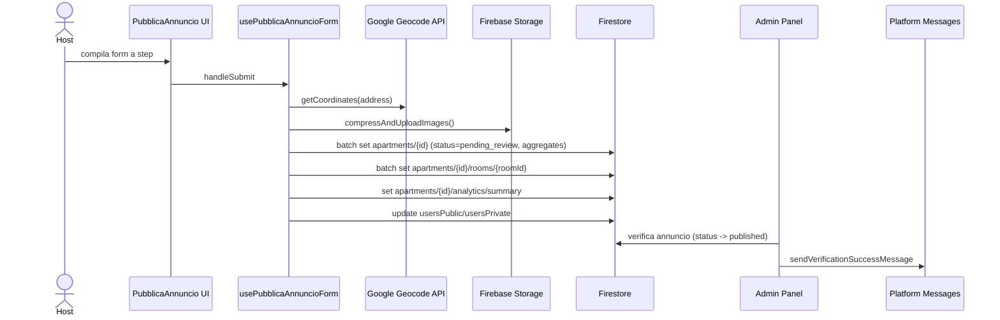
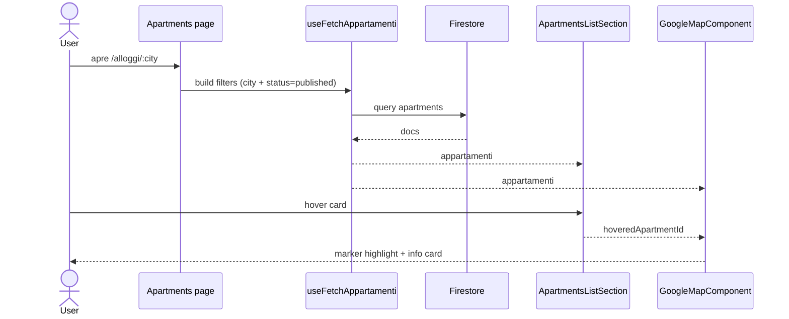
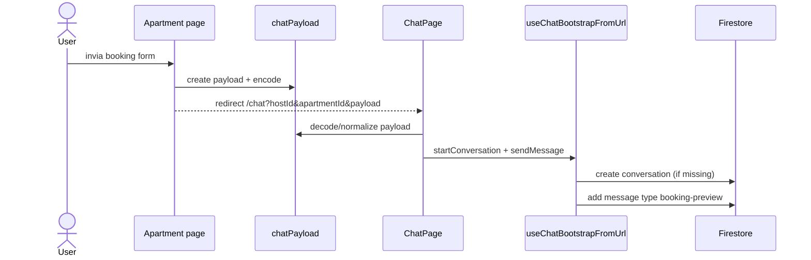
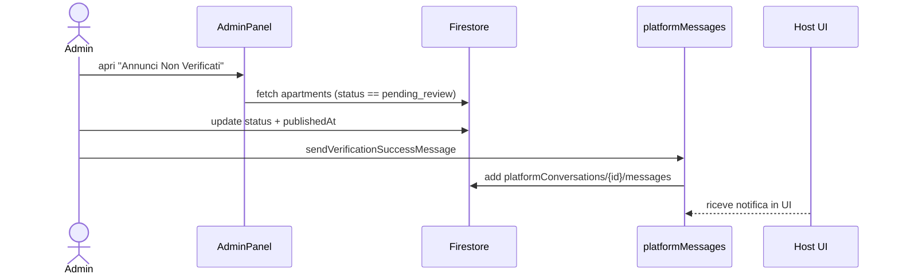

# Architettura

## Panoramica architettura
Il progetto e' una SPA React con backend serverless su Firebase (Firestore + Storage) e Cloud Functions per il bridge auth tra Clerk e Firebase Auth. La logica di business e' prevalentemente client-side, con enforcement di sicurezza tramite Firestore Rules.
File coinvolti: `src/main.jsx`, `src/app/router.jsx`, `src/infrastructure/firebase/index.js`, `functions/index.js`, `firebase.json`, `firestore.rules`

## Frontend (SPA, routing, stato)
- Routing: React Router con layout separati (pubblico e auth) e route protette.
- Stato: Redux per lista appartamenti e citta selezionata.
- UI: componenti modulari per sezioni pagina e layout.
File coinvolti: `src/app/router.jsx`, `src/app/routes/index.js`, `src/ui/components/layouts/MainLayout.jsx`, `src/ui/components/layouts/AuthLayout.jsx`, `src/app/store/store.jsx`, `src/app/store/slices/appartamentiSlice.jsx`, `src/app/store/slices/citySlice.jsx`, `src/ui/components`

## Auth (Clerk + Firebase bridge)
- Clerk gestisce login e sessioni.
- Bridge client (`useFirebaseBridgeAuth`) ottiene JWT Clerk e lo scambia con custom token Firebase tramite Cloud Function.
- Admin gating: custom claims Firebase (`role=admin`) + `AdminRoute`.
File coinvolti: `src/main.jsx`, `src/ui/components/common/clerk/UserInit.jsx`, `src/ui/hooks/auth/useFirebaseBridgeAuth.js`, `functions/index.js`, `src/ui/hooks/users/useIsAdmin.js`, `src/ui/components/common/clerk/AdminRoute.jsx`, `docs/firebase-auth-bridge-setup.md`

## Firebase (Firestore, Storage, Analytics)
- Firestore: documenti per users, apartments, conversations, reports, reviews.
- Storage: immagini annuncio e stanze (`immagini/apt_<id>` e `immagini/apt_<id>/rooms/<roomId>`).
- Analytics: metriche annuncio aggiornate via transazioni e subcollection `analytics`.
File coinvolti: `src/infrastructure/firebase/index.js`, `firestore.rules`, `src/infrastructure/firebase/adapters/compressAndUploadImages.js`, `src/infrastructure/firebase/adapters/annunci.js`, `src/infrastructure/firebase/analytics/ApartmentAnalyticsService.js`, `src/infrastructure/firebase/repositories/FirestoreAnalyticsRepository.js`

## Mappe e geocoding
- Google Maps JS API per mappa e marker.
- Geocoding client per trasformare indirizzo in coordinate al publish.
File coinvolti: `src/ui/components/common/mapComponents/GoogleMapComponent.jsx`, `src/ui/components/sections/apartmentsSection/ApartmentsMapSection.jsx`, `src/ui/helpers/getCoordinates.js`, `src/ui/pages/Apartments.jsx`, `src/ui/pages/Apartment.jsx`

## Flussi principali (Mermaid)
**Publish listing**

File coinvolti: `src/ui/pages/PubblicaAnnuncio.jsx`, `src/ui/hooks/forms/usePubblicaAnnuncioForm.js`, `src/ui/helpers/getCoordinates.js`, `src/infrastructure/firebase/adapters/compressAndUploadImages.js`, `src/ui/components/sections/adminSection/AdminAnnunciSection.jsx`, `src/infrastructure/firebase/adapters/platformMessages.js`

**Search + map sync**

File coinvolti: `src/ui/pages/Apartments.jsx`, `src/ui/hooks/fetches/useFetchAppartamenti.js`, `src/infrastructure/firebase/repositories/FirestoreApartmentRepository.js`, `src/ui/components/sections/apartmentsSection/ApartmentsListSection.jsx`, `src/ui/components/sections/apartmentsSection/ApartmentsMapSection.jsx`, `src/ui/components/common/mapComponents/GoogleMapComponent.jsx`, `src/ui/components/common/mapComponents/ApartmentMarker.jsx`

**Booking -> chat**

File coinvolti: `src/ui/pages/Apartment.jsx`, `src/ui/helpers/chatPayload.js`, `src/ui/pages/ChatPage.jsx`, `src/ui/hooks/chat/useChatBootstrapFromUrl.js`, `src/infrastructure/firebase/adapters/chat.js`

**Admin verify**

File coinvolti: `src/ui/pages/AdminPanel.jsx`, `src/ui/hooks/fetches/useFetchUncheckedAnnunci.js`, `src/ui/components/sections/adminSection/AdminAnnunciSection.jsx`, `src/infrastructure/firebase/adapters/platformMessages.js`, `src/ui/hooks/chat/usePlatformMessages.js`
